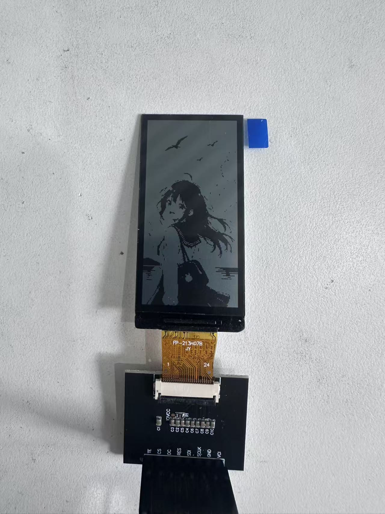

# 2.13" 122×250 reflective SPI module (ST7305) — documentation & samples

**简体中文：** [`README.md`](README.md)

---

> This repository provides an **ESP-IDF sample project**, datasheets, and specifications.

## Product overview

| Item | Description |
|:--|:--|
| Module | 2.13-inch **reflective LCD** (monochrome), **122×250** resolution |
| Interface | **SPI** |
| Driver IC | **ST7305** |
| Spec ID | **`2.13-lcd-122x250-spi-st7305`** is the common product designation in documentation |
| AMOLED variant | Same nominal size **CO5300 QSPI AMOLED** is in **`2.13-amoled-410x502-qspi-co5300`** — different panel and interface |

---

## Repository layout

### Top-level

| Path | Contents |
|:--|:--|
| `assets/` | Demo screenshots for sample projects |
| `docs/` | Datasheets and specifications |
| `examples/` | **Sample projects** |

### `examples/` layout

| Location | Description |
|:--|:--|
| `examples/` root | ESP32-S3 bringup: ST7305 SPI display and packed image buffer demo |

### Sample project paths

| Description | Path |
|:--|:--|
| ST7305 SPI bringup (includes `tools/png_to_st7305.py`) | `examples/esp32s3-2.13lcd-122x250-spi-st7305-bringup/` |

#### Sample demo

  

